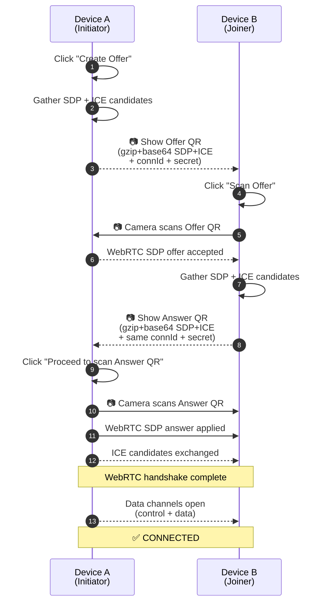
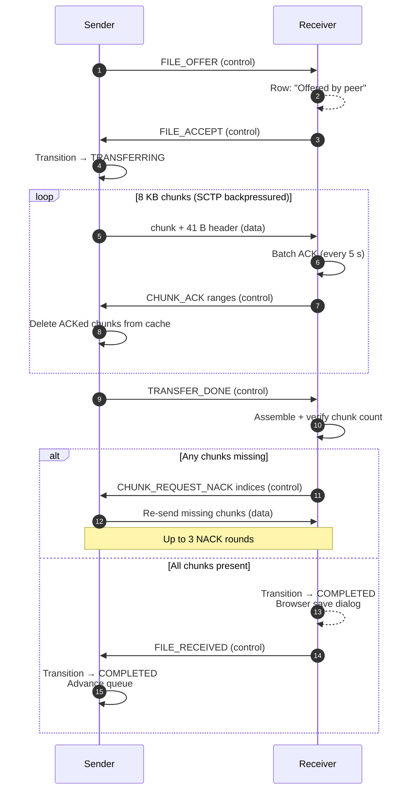

# Local File Share

Peer-to-peer file sharing via QR code handshake over your local network — no servers, no cloud, no accounts.

Two devices on the same WiFi/LAN establish a direct WebRTC connection by scanning two QR codes, then exchange files of up to 500 MB directly browser-to-browser. Files never leave your local network.

---

## Highlights

- **Zero infrastructure** — pure browser app, the only "server" is an optional static-file container (Nginx) you run yourself
- **Direct WebRTC** — encrypted (DTLS-SRTP), peer-to-peer data channels
- **Private** — files never traverse anything but the LAN

---

## How it works

The app is a single page with two tabs:

| Tab          | What lives here                                                                  |
| ------------ | -------------------------------------------------------------------------------- |
| **Connection** | The 2-QR handshake: three-step progress bar (Offer → Answer → Connected)        |
| **Files**      | The unified transfer list: send (with `+`), receive (with Accept/Reject), history |


## The 2-QR connection handshake

No signalling server, no shared link. Both devices generate and display their own QR code; the only thing travelling through the air is your phone's camera.



Key properties:

- The `connId` and `secret` in both QRs are matched on the initiator side — a wrong pair fails the handshake before any peer-connection state is exposed
- The SDP+ICE payload is gzip-compressed and base64-encoded so it fits a single scannable QR
- The initiator's "Proceed to scan Answer QR" is a **manual** advance so the joiner has a guaranteed window to scan the offer before it disappears

---

## The file-transfer protocol

Once connected, two WebRTC data channels carry all traffic: a **control channel** (JSON, ordered) for signalling and a **data channel** (binary, ordered, 1 MiB backpressure threshold) for the file chunks themselves. Separating them means a stalled chunk stream can never block a `FILE_ACCEPT` or `FILE_RECEIVED`.



If `FILE_RECEIVED` doesn't arrive within 30 s, the sender marks the file `FAILED` and advances the queue.

---

## Quick start — Docker (recommended)

The container builds the Vite bundle and serves it over Nginx with an auto-generated self-signed certificate. The LAN IP is detected at container start so the cert's `subjectAltName` matches it — meaning the other device's browser will accept the cert without a manual exception (after one initial trust on the host that's serving it).

```bash
# Build and start
docker compose up -d --build

# Tail the startup log to see the URL
docker compose logs -f app

# Stop
docker compose down

# Rebuild after pulling new code
docker compose up -d --build

# Run on a different host port (default 3000)
# Edit docker-compose.yml → "3000:443" → "8080:443"
```

The entrypoint prints the URL on boot, e.g.:

```
[entrypoint] cert ready — open https://<lan_ip>:3000 from other devices
```